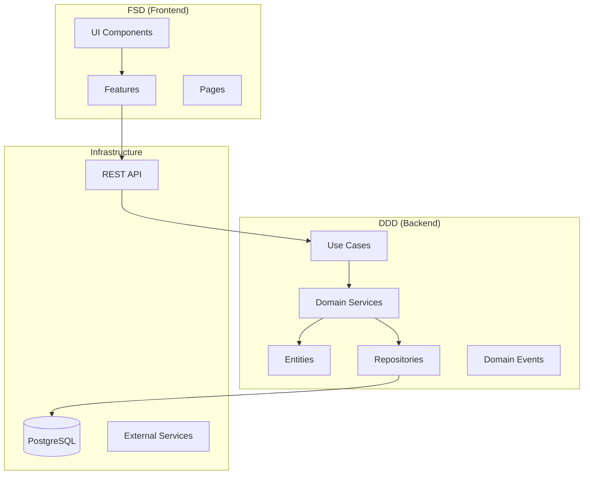

# 🧼 AKSI Dry Cleaning Order System

Professional dry‑cleaning management system with a production‑grade Order Wizard.

<div align="center">


[](https://orval.dev)
[](https://github.com/fedotiuk-dm/aksi-app-java-spring-nextjs_1.0/actions/workflows/update-readme-versions.yml)


<br/>

[](#-architecture)
[](#-documentation)

</div>

---

### 🔗 Quick links

- Overview • Features • Tech Stack • Architecture • Structure • Quick Start • Docs • Contributing • License

---

## ✨ Overview

AKSI is a modern dry‑cleaning order management system built with Domain‑Driven Design (DDD) on the backend and Feature‑Sliced Design (FSD) on the frontend. The system covers the full customer journey from intake to delivery, with a robust guided Order Wizard at its core.

#### Order Wizard at a glance

1. Client & basic order info
2. Item manager with multi‑step item flow and live pricing
3. Global order parameters (discounts, urgency, payment)
4. Review and printable receipt (PDF with QR)

---

## 🧩 Key Features

<div align="center">

|       👤 Clients       |         🧺 Orders         |            💰 Pricing             |
| :--------------------: | :-----------------------: | :-------------------------------: |
| Quick search & history |    Guided Order Wizard    | Transparent modifiers & discounts |
|    Contacts & tags     | Cyclic item add/edit flow |       Live preview & totals       |
|   GDPR‑friendly data   |      Status tracking      |        Rounding & policies        |

|      📸 Photos       |     🧾 Documents     |            🔐 Security             |
| :------------------: | :------------------: | :--------------------------------: |
| Before/After gallery | PDF receipts with QR | Cookie‑based auth + Redis sessions |
|   Auto‑thumbnails    | Localized templates  |         Role‑based access          |

</div>

---

## 🛠 Tech Stack

### Backend (Java 21 + Spring Boot 3.5.4)

**Core Framework:**

- Java 21, Spring Boot 3.5.4
- Spring Web, Data JPA, Validation, Security, Actuator
- Spring Session with Redis for distributed sessions

**Database & Persistence:**

- PostgreSQL 17 with Liquibase migrations
- Spring Data JPA with Hibernate
- JPA Specifications for dynamic queries

**Mapping & Code Generation:**

- MapStruct 1.6.3 for DTO ↔ Entity mapping
- Lombok 1.18.38 for boilerplate reduction
- OpenAPI Generator for DTO/Controller generation

**Document Processing:**

- Apache PDFBox 3.0.5 for receipt PDF generation
- ZXing 3.5.3 for QR code generation
- Custom receipt templating system

**Security & Auth:**

- Cookie-based authentication (no JWT on client)
- Spring Security with Redis session store
- Role-based access control with permissions

### Frontend (Next.js 15 + React 19)

**Core Framework:**

- Next.js 15.3.4 with App Router
- React 19.1.0, TypeScript 5
- Feature-Sliced Design (FSD) architecture

**UI & State Management:**

- Material-UI 7.1.1 (MUI) with custom theming
- TanStack Query 5.81.5 for server state
- Zustand 5.0.6 for client UI state
- Zod 4.0.5 for runtime validation

**API Integration:**

- Orval for auto-generated React Query hooks
- OpenAPI → TypeScript client generation
- Axios with interceptors for HTTP handling

### DevOps & Quality

**Build & Testing:**

- Maven 3.9+ with multi-profile builds
- JUnit 5 for backend testing
- Checkstyle, PMD, SpotBugs for code quality
- Jest + Testing Library for frontend

**Development:**

- Docker Compose for local environment
- Hot reload for both frontend and backend
- Swagger UI for API documentation

---

## 🏗 Architecture

Principle: DDD inside (backend), FSD outside (frontend). Controllers are thin; business logic lives in domain services. OpenAPI contracts are the single source of truth.



Backend principles

- API‑first (OpenAPI) as the source of truth
- Cookie‑based auth; no JWT on the client
- Controllers → Services → Repository (no business logic in controllers)
- DTO ↔ Entity mapping via MapStruct
- Database migrations via Liquibase

---

## 📂 Project Structure

```
backend/
  src/main/resources/openapi/       # OpenAPI contracts (single source of truth)
  architecture/                     # Core architecture docs
frontend/
  shared/api/generated/             # Orval‑generated React Query hooks
  features/                         # Thin FSD UI features
docker/                             # docker-compose for local dev
```

---

## 🚀 Quick Start

Prerequisites

- Java 21+, Maven 3.9+
- Node.js 18+
- PostgreSQL 17

Backend

```
cd backend
mvn clean install -Pdev-fast
mvn spring-boot:run
```

Frontend

```
cd frontend
npm install
npm run dev
```

Docker (optional)

```
cd docker
docker compose -f docker-compose.dev.yml up -d
```

URLs

- Frontend: http://localhost:3000
- Backend API: http://localhost:8080
- Swagger UI: http://localhost:8080/swagger-ui.html

---

## 📚 Documentation

Architecture

- OpenAPI‑first approach: `backend/architecture/OPENAPI_FIRST_APPROACH.md`
- Domain architecture: `backend/architecture/DOMAIN_ARCHITECTURE.md`
- Project structure: `backend/architecture/PROJECT_STRUCTURE.md`
- Domain interactions: `backend/architecture/DOMAIN_INTERACTIONS.md`
- Cookie‑based auth: `backend/architecture/COOKIE_BASED_AUTH.md`

Order Wizard (frontend notes)

- FSD implementation: `docs-helpers/frontend/order_wizard_fsd_implementation.md`
- Single‑page Order Wizard architecture: `docs-helpers/frontend/SinglePage_OrderWizard_Architecture.md`

---

## 🤝 Contributing

- Follow DDD inside, FSD outside
- Use Orval‑generated hooks directly in UI (no custom API clients)
- Zustand only for UI state; API data lives in React Query
- Keep files focused and testable; one responsibility per file
- Conventional Commits, ESLint/Prettier (FE), Checkstyle/PMD (BE)

---

## 📄 License

MIT License © 2025 AKSI Chemical Cleaning

See LICENSE file or the badges above for details.
