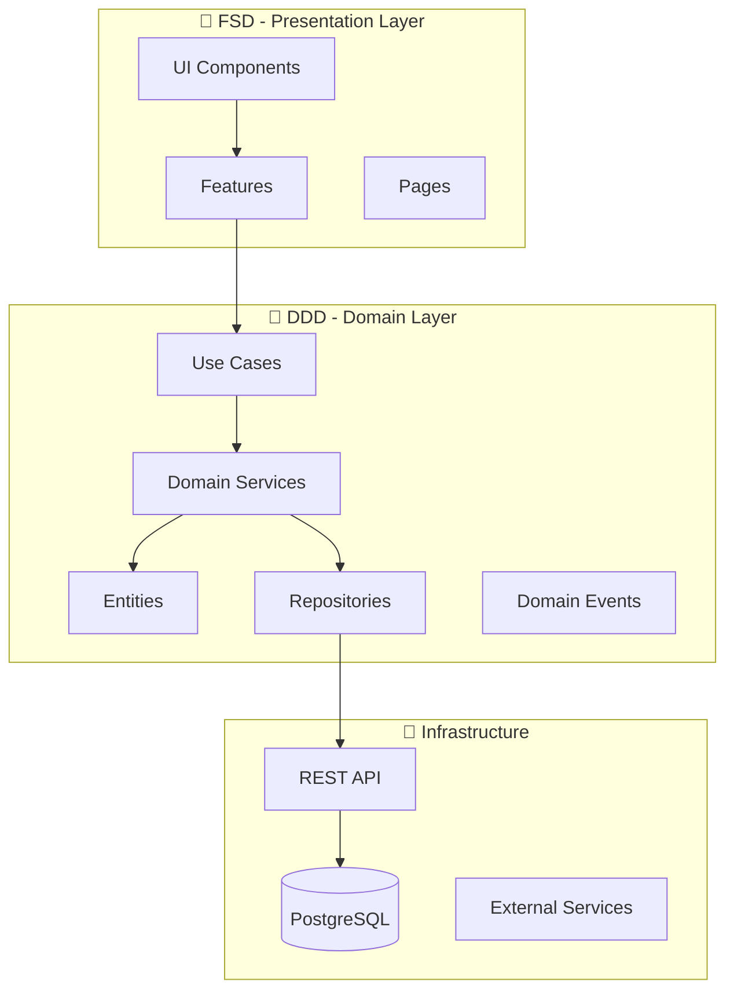

# 🧼 AKSI Chemical Cleaning Management System

**Професійна система управління хімчисткою з Order Wizard**


[](#-документація)
[](#-архітектура)

---

## 📋 Зміст

- [🎯 Про проект](#-про-проект)
- [✨ Ключові можливості](#-ключові-можливості)
- [🛠️ Технологічний стек](#️-технологічний-стек)
- [🏗️ Архітектура](#️-архітектура)
- [🚀 Швидкий старт](#-швидкий-старт)
- [📖 Документація](#-документація)
- [🤝 Внесок у розробку](#-внесок-у-розробку)
- [👥 Команда розробки](#-команда-розробки)
- [📄 Ліцензія](#-ліцензія)

---

## 🎯 Про проект

**AKSI Chemical Cleaning System** — це сучасна система управління хімчисткою, розроблена з використанням принципів Domain-Driven Design (DDD) та Feature-Sliced Design (FSD). Система забезпечує повний цикл обслуговування клієнтів: від прийому замовлень до видачі готових речей.

### 🎪 Order Wizard - Серце системи

Інтерактивний покроковий майстер оформлення замовлень з 4 основними етапами:

1. **👤 Клієнт та базова інформація** - Пошук/створення клієнта, базові дані замовлення
2. **👕 Менеджер предметів** - Циклічне додавання предметів з детальними характеристиками
3. **⚙️ Загальні параметри** - Знижки, терміновість, спосіб оплати
4. **📋 Підтвердження та квитанція** - Фінальний перегляд та формування документів

---

## ✨ Ключові можливості

<div align="center">

| 🔍 **Управління клієнтами** | 📦 **Управління замовленнями** |   💰 **Розрахунок вартості**   |
| :-------------------------: | :----------------------------: | :----------------------------: |
| Пошук та створення клієнтів |    Покроковий Order Wizard     |  Гнучка система модифікаторів  |
|      Історія замовлень      |  Циклічне додавання предметів  | Автоматичні знижки та надбавки |
|    Контактна інформація     |     Детальна категоризація     |    Прозорий розрахунок ціни    |

| 📸 **Фотодокументація** | 🧾 **Формування документів** |   📊 **Звітність**   |
| :---------------------: | :--------------------------: | :------------------: |
|  Фото до/після обробки  |     Професійні квитанції     |  Детальна аналітика  |
|  Автоматичне стиснення  |   QR-коди для відстеження    |   Фінансові звіти    |
|    Галерея зображень    |        PDF генерація         | Статистика по філіях |

</div>

---

## 🛠️ Технологічний стек

<div align="center">

### Backend

[](https://openjdk.java.net/)
[](https://spring.io/projects/spring-boot)
[](https://www.postgresql.org/)
[](https://hibernate.org/)

### Frontend

[](https://nextjs.org/)
[](https://www.typescriptlang.org/)
[](https://mui.com/)
[](https://tanstack.com/query)

### State Management & Forms

[](https://github.com/pmndrs/zustand)
[](https://react-hook-form.com/)
[](https://zod.dev/)

### DevOps & Tools

[](https://maven.apache.org/)
[](https://www.liquibase.org/)
[](https://swagger.io/)

</div>

---

## 🏗️ Архітектура

### Принцип "DDD inside, FSD outside"

<div align="center">



</div>

### Ключові принципи:

- **🎯 Single Responsibility** - Кожен компонент має одну відповідальність
- **🔒 Encapsulation** - Приховування внутрішньої реалізації
- **🔄 Dependency Inversion** - Залежність від абстракцій
- **📦 Modular Architecture** - Модульна структура з чіткими межами
- **🧪 Testability** - Легке тестування всіх компонентів

---

## 🚀 Швидкий старт

### Передумови

- **Java 21+**
- **Node.js 18+**
- **PostgreSQL 17+**
- **Maven 3.9+**

### 1️⃣ Клонування репозиторію

```bash
git clone https://github.com/your-username/aksi-app.git
cd aksi-app
```

### 2️⃣ Налаштування бази даних

```sql
CREATE DATABASE aksi_chemical_cleaning;
CREATE USER aksi_user WITH PASSWORD 'your_password';
GRANT ALL PRIVILEGES ON DATABASE aksi_chemical_cleaning TO aksi_user;
```

### 3️⃣ Запуск Backend

```bash
cd backend
mvn clean install
mvn spring-boot:run
```

### 4️⃣ Запуск Frontend

```bash
cd frontend
npm install
npm run dev
```

### 5️⃣ Доступ до додатку

- **Frontend:** http://localhost:3000
- **Backend API:** http://localhost:8080
- **Swagger UI:** http://localhost:8080/swagger-ui.html

---

## 📖 Документація

### 📚 Архітектурна документація

- [🏛️ Domain-Driven Design принципи](./docs/architecture/ddd-principles.md)
- [🎨 Feature-Sliced Design структура](./docs/architecture/fsd-structure.md)
- [🔄 Order Wizard workflow](./docs/features/order-wizard-workflow.md)

### 🛠️ Технічна документація

- [⚙️ Налаштування середовища розробки](./docs/setup/development-environment.md)
- [🗄️ Схема бази даних](./docs/database/schema.md)
- [🔌 API документація](./docs/api/endpoints.md)

### 📋 Бізнес-логіка

- [💰 Система розрахунку цін](./docs/business/pricing-system.md)
- [👤 Управління клієнтами](./docs/business/client-management.md)
- [📦 Життєвий цикл замовлення](./docs/business/order-lifecycle.md)

---

## 🤝 Внесок у розробку

### Правила розробки

1. **🏗️ Дотримуйтесь архітектури "DDD inside, FSD outside"**
2. **🔌 Використовуйте готові Orval хуки замість кастомних API викликів**
3. **🗂️ Zustand тільки для UI стану, React Query для API даних**
4. **📏 Кожен файл < 200 рядків, одна відповідальність**
5. **🔒 Повна типізація з TypeScript + Zod**

### Workflow розробки

```bash
# 1. Створіть feature branch
git checkout -b feature/your-feature-name

# 2. Розробіть функціональність в доменному шарі
# domains/your-domain/

# 3. Створіть "тонкі" UI компоненти
# features/your-feature/

# 4. Запустіть тести та лінтинг
npm run test
npm run lint

# 5. Створіть Pull Request
git push origin feature/your-feature-name
```

### 📋 Code Style

- **ESLint + Prettier** для Frontend
- **Checkstyle + SpotBugs** для Backend
- **Conventional Commits** для повідомлень комітів
- **Husky** для pre-commit hooks

---

## 👥 Команда розробки

<div align="center">

<table>
<tr>
<td align="center">
<br />
<b>Fedotiuk Dmytro</b><br />
<sub>Developer</sub><br />
<a href="https://github.com/username1">💻</a>
<a href="mailto:aksi.vn.ua@gmail.com">📧</a>
</td>
<td align="center">
<br />
</table>

---

**📞 Зв'язок з нами:**

[](https://aksi.vn.ua)
[](mailto:aksi.vn.ua@gmail.com)
[](https://t.me/aksi_vnua)

</div>

---

## 📄 Ліцензія

<div align="center">

### MIT License

```
Copyright (c) 2025 AKSI Chemical Cleaning

Permission is hereby granted, free of charge, to any person obtaining a copy
of this software and associated documentation files (the "Software"), to deal
in the Software without restriction, including without limitation the rights
to use, copy, modify, merge, publish, distribute, sublicense, and/or sell
copies of the Software, and to permit persons to whom the Software is
furnished to do so, subject to the following conditions:

The above copyright notice and this permission notice shall be included in all
copies or substantial portions of the Software.

THE SOFTWARE IS PROVIDED "AS IS", WITHOUT WARRANTY OF ANY KIND, EXPRESS OR
IMPLIED, INCLUDING BUT NOT LIMITED TO THE WARRANTIES OF MERCHANTABILITY,
FITNESS FOR A PARTICULAR PURPOSE AND NONINFRINGEMENT. IN NO EVENT SHALL THE
AUTHORS OR COPYRIGHT HOLDERS BE LIABLE FOR ANY CLAIM, DAMAGES OR OTHER
LIABILITY, WHETHER IN AN ACTION OF CONTRACT, TORT OR OTHERWISE, ARISING FROM,
OUT OF OR IN CONNECTION WITH THE SOFTWARE OR THE USE OR OTHER DEALINGS IN THE
SOFTWARE.
```

---

<table>
<tr>
<td>

**🟢 Дозволено:**

- ✅ Комерційне використання
- ✅ Модифікація
- ✅ Розподіл
- ✅ Приватне використання

</td>
<td>

**🔴 Обмеження:**

- ❌ Відповідальність
- ❌ Гарантії

</td>
<td>

**📋 Умови:**

- 📄 Включення ліцензії
- 📄 Включення копірайту

</td>
</tr>
</table>

[](https://opensource.org/licenses/MIT)

</div>

---

## ❤️ Підтримка проекту

<div align="center">

Якщо цей проект корисний для вас, підтримайте нас:

[](https://github.com/your-username/aksi-app)
[](https://github.com/your-username/aksi-app/fork)

**Дякуємо всім контрибюторам! 🙏**

</div>

---

<div align="center">

**Зроблено з ❤️ командою AKSI**


</div>
