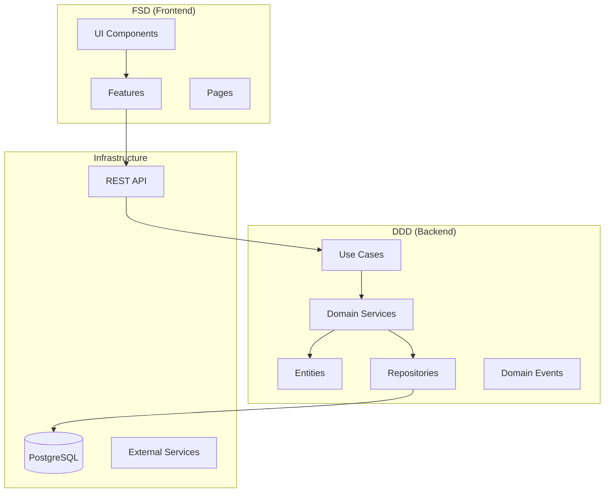

# 🧼 AKSI Dry Cleaning Order System

Professional dry‑cleaning management system with a production‑grade Order Wizard.

<div align="center">


[](https://orval.dev)
[](https://github.com/fedotiuk-dm/aksi-app-java-spring-nextjs_1.0/actions/workflows/update-readme-versions.yml)


<br/>

[](#-architecture)
[](#-documentation)

</div>

---

### 🔗 Quick links

- Overview • Features • Tech Stack • Architecture • Structure • Quick Start • Security • Monitoring • Deployment • CI/CD • Docs • Contributing • License

---

## ✨ Overview

AKSI is a modern dry‑cleaning order management system built with Domain‑Driven Design (DDD) on the backend and Feature‑Sliced Design (FSD) on the frontend. The system covers the full customer journey from intake to delivery, with a robust guided Order Wizard at its core.

#### Order Wizard at a glance

1. Client & basic order info
2. Item manager with multi‑step item flow and live pricing
3. Global order parameters (discounts, urgency, payment)
4. Review and printable receipt (PDF with QR)

---

## 🧩 Key Features

<div align="center">

|       👤 Clients       |         🧺 Orders         |            💰 Pricing             |
| :--------------------: | :-----------------------: | :-------------------------------: |
| Quick search & history |    Guided Order Wizard    | Transparent modifiers & discounts |
|    Contacts & tags     | Cyclic item add/edit flow |       Live preview & totals       |
|   GDPR‑friendly data   |      Status tracking      |        Rounding & policies        |

|      📸 Photos       |     🧾 Documents     |            🔐 Security             |
| :------------------: | :------------------: | :--------------------------------: |
| Before/After gallery | PDF receipts with QR | Cookie‑based auth + Redis sessions |
|   Auto‑thumbnails    | Localized templates  |         Role‑based access          |

</div>

---

## 🛠 Tech Stack

### Backend (Java 21 + Spring Boot 3.5.5)

**Core Framework:**

- Java 21, Spring Boot 3.5.5
- Spring Web, Data JPA, Validation, Security, Actuator
- Spring Session with Redis for distributed sessions

**Database & Persistence:**

- PostgreSQL 17 with Liquibase migrations
- Spring Data JPA with Hibernate
- JPA Specifications for dynamic queries

**Mapping & Code Generation:**

- MapStruct 1.6.3 for DTO ↔ Entity mapping
- Lombok 1.18.38 for boilerplate reduction
- OpenAPI Generator for DTO/Controller generation

**Document Processing:**

- Apache PDFBox 3.0.5 for receipt PDF generation
- ZXing 3.5.3 for QR code generation
- Custom receipt templating system

**Security & Auth:**

- Cookie-based authentication (no JWT on client)
- Spring Security with Redis session store
- Role-based access control with permissions

### Frontend (Next.js 15 + React 19)

**Core Framework:**

- Next.js 15.4.5 with App Router
- React 19.1.0, TypeScript 5
- Feature-Sliced Design (FSD) architecture

**UI & State Management:**

- Material-UI 7.1.1 (MUI) with custom theming
- TanStack Query 5.81.5 for server state
- Zustand 5.0.6 for client UI state
- Zod 4.0.5 for runtime validation

**API Integration:**

- Orval for auto-generated React Query hooks
- OpenAPI → TypeScript client generation
- Axios with interceptors for HTTP handling

### DevOps & Quality

**Build & Testing:**

- Maven 3.9+ with multi-profile builds
- JUnit 5 for backend testing
- Checkstyle, PMD, SpotBugs for code quality
- Jest + Testing Library for frontend

**Development:**

- Docker Compose for local environment
- Hot reload for both frontend and backend
- Swagger UI for API documentation

---

## 🏗 Architecture

Principle: DDD inside (backend), FSD outside (frontend). Controllers are thin; business logic lives in domain services. OpenAPI contracts are the single source of truth.



Backend principles

- API‑first (OpenAPI) as the source of truth
- Cookie‑based auth; no JWT on the client
- Controllers → Services → Repository (no business logic in controllers)
- DTO ↔ Entity mapping via MapStruct
- Database migrations via Liquibase

---

## 📂 Project Structure

```
backend/
  src/main/resources/openapi/       # OpenAPI contracts (single source of truth)
  architecture/                     # Core architecture docs
frontend/
  shared/api/generated/             # Orval‑generated React Query hooks
  features/                         # Thin FSD UI features
docker/                             # docker-compose for local dev
```

---

## 🚀 Quick Start

Prerequisites

- Java 21+, Maven 3.9+
- Node.js 18+
- PostgreSQL 17

Backend

```
cd backend
mvn clean install -Pdev-fast
mvn spring-boot:run
```

Frontend

```
cd frontend
npm install
npm run dev
```

Docker (optional)

```
cd docker
docker compose -f docker-compose.dev.yml up -d
```

URLs

- Frontend: http://localhost:3000
- Backend API: http://localhost:8080
- Swagger UI: http://localhost:8080/swagger-ui.html

---

## 🔐 Security

### Cookie-Based Authentication

The application uses **cookie-based authentication** instead of JWT tokens for enhanced security:

- **HttpOnly Cookies**: Session cookies are HttpOnly to prevent JavaScript access
- **Secure Cookies**: HTTPS-only cookies in production
- **SameSite Policy**: Lax policy for CSRF protection while maintaining usability
- **CSRF Protection**: Double-submit cookie pattern with secure token handling

### Security Features

- 🔒 **Spring Security** with custom authentication provider
- 🛡️ **CSRF Protection** with secure cookie tokens
- 🚦 **Rate Limiting** with Redis-backed counters
- 🔐 **Password Policies** with configurable complexity rules
- 📊 **Login Attempt Monitoring** with account lockout
- 🔍 **Security Audit Logging** for compliance
- 🏗️ **Security Headers** (CSP, HSTS, X-Frame-Options, etc.)

### Production Security

- ✅ **HTTPS Enforcement** with HSTS headers
- ✅ **Secure Headers** via Spring Security configuration
- ✅ **Environment-Specific** security settings
- ✅ **Redis Session Store** for distributed sessions
- ✅ **Database Encryption** for sensitive data

---

## 📊 Monitoring & Observability

### Spring Actuator Endpoints

The application provides comprehensive monitoring through Spring Boot Actuator:

```
GET /management/health      - Application health status
GET /management/info        - Application information
GET /management/metrics     - Application metrics
GET /management/prometheus  - Prometheus metrics format
GET /management/loggers     - Logging configuration
```

### Health Checks

- **Database Health**: PostgreSQL connectivity and basic queries
- **Redis Health**: Cache connectivity and ping responses
- **Application Health**: Overall application status with details

### Structured Logging

- **Correlation ID**: Request tracing with X-Correlation-ID header
- **Trace ID**: Unique trace identifier for request chains
- **Structured Format**: JSON logging with MDC context
- **Log Levels**: Configurable per component and environment

### Metrics & Monitoring

- **Micrometer**: JVM, HTTP, database, and custom metrics
- **Prometheus**: Metrics export for monitoring dashboards
- **Health Probes**: Kubernetes-ready liveness and readiness probes

---

## 🚀 Deployment

### Docker Production Setup

#### Prerequisites

- Docker 24+
- Docker Compose 2.0+
- PostgreSQL 17
- Redis 8

#### Production Deployment

1. **Clone and setup environment:**

```bash
git clone <repository-url>
cd aksi-app
cp docker/env.example docker/.env
# Edit docker/.env with your production values
```

2. **Configure environment variables:**

```bash
# Edit docker/.env with production values
POSTGRES_PASSWORD=your_secure_db_password
REDIS_PASSWORD=your_secure_redis_password
GLITCHTIP_DSN=your_monitoring_dsn
```

3. **Deploy with production override:**

```bash
cd docker
docker-compose -f docker-compose.yml -f docker-compose.override.yml up -d
```

4. **Verify deployment:**

```bash
# Check service health
curl http://localhost:8080/management/health

# Check application logs
docker-compose logs -f backend
```

### Environment Configuration

The application supports multiple environments through Spring profiles:

- **dev**: Development with relaxed security
- **prod**: Production with strict security and monitoring

Key environment variables are documented in `docker/env.example`.

### Health Monitoring

Monitor your deployment using the built-in health checks:

```bash
# Application health
curl http://localhost:8080/management/health

# Database health
curl http://localhost:8080/management/health/db

# Redis health
curl http://localhost:8080/management/health/redis

# Metrics endpoint
curl http://localhost:8080/management/prometheus
```

---

## 🔄 CI/CD Pipeline

### GitHub Actions Workflows

The project includes comprehensive CI/CD pipelines:

#### Main CI/CD Pipeline (`.github/workflows/ci-cd-pipeline.yml`)

- **Backend Testing**: Unit tests, integration tests, code quality checks
- **Frontend Testing**: Linting, type checking, unit tests
- **Security Scanning**: Trivy vulnerability scanning
- **Docker Building**: Automated container builds and registry pushes
- **Multi-Environment**: Different configurations for dev/staging/production

#### Liquibase Checks (`.github/workflows/liquibase-checks.yml`)

- **Migration Validation**: Dry-run testing of database changes
- **Checksum Verification**: Ensures migration integrity
- **Rollback Testing**: Validates rollback scripts availability
- **Best Practices**: Checks for unique IDs and proper author tags

### Pipeline Features

- ✅ **Parallel Execution**: Backend and frontend tests run in parallel
- ✅ **Dependency Caching**: Maven and npm dependencies cached for faster builds
- ✅ **Test Containers**: PostgreSQL and Redis for integration testing
- ✅ **Artifact Upload**: Test results and build artifacts stored
- ✅ **Security Scanning**: Automated vulnerability detection
- ✅ **Deployment Ready**: Built containers pushed to registry

### Running Locally

```bash
# Run full test suite
mvn test -Pdev-fast

# Run integration tests only
mvn test -Dtest="*IntegrationTest"

# Run Liquibase validation
mvn liquibase:validate

# Build production containers
docker build -f backend/Dockerfile -t aksi-backend ./backend
docker build -f frontend/Dockerfile -t aksi-frontend ./frontend
```

---

## 📚 Documentation

Architecture

- OpenAPI‑first approach: `backend/architecture/OPENAPI_FIRST_APPROACH.md`
- Domain architecture: `backend/architecture/DOMAIN_ARCHITECTURE.md`
- Project structure: `backend/architecture/PROJECT_STRUCTURE.md`
- Domain interactions: `backend/architecture/DOMAIN_INTERACTIONS.md`
- Cookie‑based auth: `backend/architecture/COOKIE_BASED_AUTH.md`

Order Wizard (frontend notes)

- FSD implementation: `docs-helpers/frontend/order_wizard_fsd_implementation.md`
- Single‑page Order Wizard architecture: `docs-helpers/frontend/SinglePage_OrderWizard_Architecture.md`

---

## 🤝 Contributing

- Follow DDD inside, FSD outside
- Use Orval‑generated hooks directly in UI (no custom API clients)
- Zustand only for UI state; API data lives in React Query
- Keep files focused and testable; one responsibility per file
- Conventional Commits, ESLint/Prettier (FE), Checkstyle/PMD (BE)

---

## 📄 License

MIT License © 2025 AKSI Chemical Cleaning

See LICENSE file or the badges above for details.
