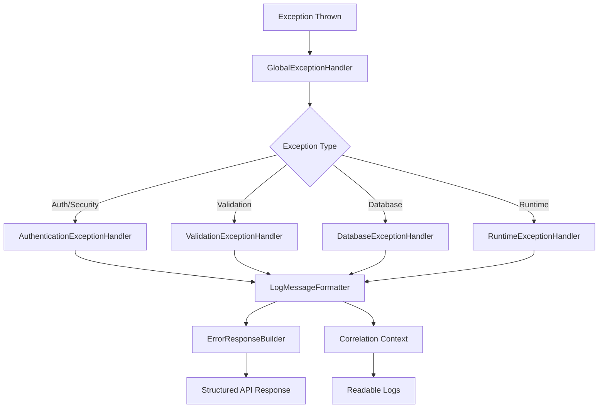

# 🛡️ **EXCEPTION HANDLING ARCHITECTURE**

## 📋 **Overview**

Refactored exception handling system following **SOLID principles** and **Domain-Driven Design**. Transformed a monolithic 511-line `GlobalExceptionHandler` into a modular, maintainable, and testable architecture.

---

## 🏗️ **ARCHITECTURE**

### **BEFORE (Monolithic)**

```
GlobalExceptionHandler.java (511 lines)
├── Complex nested logic
├── Repeated code patterns
├── Difficult to test
├── Violates SRP principle
└── Hard to extend
```

### **AFTER (Modular)**

```
exception/
├── handler/
│   ├── GlobalExceptionHandler.java          # Thin coordinator (150 lines)
│   ├── BaseExceptionHandler.java            # Common utilities (DRY principle)
│   ├── AuthenticationExceptionHandler.java  # Auth & security errors
│   ├── ValidationExceptionHandler.java      # Request validation errors
│   ├── DatabaseExceptionHandler.java        # DB & data access errors
│   └── RuntimeExceptionHandler.java         # Runtime & general errors
├── response/
│   ├── ErrorResponseBuilder.java            # Structured response builder
│   └── ErrorContext.java                    # Error context data class
├── formatter/
│   └── LogMessageFormatter.java             # Readable log formatting
└── README.md                                # This documentation
```

---

## 🎯 **KEY IMPROVEMENTS**

### **📊 CODE METRICS**

- **Lines reduced**: 511 → ~150 in coordinator (70% reduction)
- **Classes**: 1 → 9 specialized classes (including BaseExceptionHandler)
- **Responsibilities**: Separated by domain with shared utilities
- **Testability**: Each component is unit testable
- **Code reuse**: DRY principle with common utilities in base class

### **🔍 LOG IMPROVEMENTS**

- **Correlation Context**: Every error includes `correlationId`, `requestId`, `userId`
- **Structured Formatting**: Clean, readable log messages with context
- **Environment Aware**: Production logs are concise, dev logs are detailed
- **Error Classification**: Clear categorization (`[AUTH]`, `[DATABASE]`, `[VALIDATION]`)

### **📝 EXAMPLE LOG OUTPUT**

```
[AUTH] Bad credentials failed for user: john.doe | correlationId=a1b2c3d4, request=POST /api/auth/login
[DATABASE] Duplicate key constraint violation | correlationId=e5f6g7h8, user=admin, request=POST /api/users
[VALIDATION] Field 'email' with value 'invalid-email' failed constraint: must be a well-formed email address
```

---

## 🧩 **COMPONENT RESPONSIBILITIES**

### **🎛️ GlobalExceptionHandler**

- **Role**: Thin coordinator that delegates to specialists
- **Responsibilities**: Route exceptions to appropriate handlers
- **Lines**: ~150 (was 511)

### **🏗️ BaseExceptionHandler**

- **Role**: Common utilities for all exception handlers (DRY principle)
- **Features**: Request context extraction, user authentication context
- **Methods**: `getCurrentPath()`, `getCurrentMethod()`, `getCurrentUser()`, `getRequestContext()`
- **Pattern**: Template method pattern with protected utilities

### **🔐 AuthenticationExceptionHandler**

- **Handles**: Security, authentication, authorization errors
- **Features**: User context extraction, security event logging
- **Exceptions**: `UnauthorizedException`, `BadCredentialsException`, `AuthorizationDeniedException`

### **✅ ValidationExceptionHandler**

- **Handles**: Request validation, parsing, type mismatch errors
- **Features**: Field-level validation details, enum error helpers
- **Exceptions**: `MethodArgumentNotValidException`, `HttpMessageNotReadableException`

### **🗄️ DatabaseExceptionHandler**

- **Handles**: Database, JPA, data access errors
- **Features**: Constraint violation translation, entity error extraction
- **Exceptions**: `DataIntegrityViolationException`, `JpaSystemException`

### **⚡ RuntimeExceptionHandler**

- **Handles**: Runtime errors, general exceptions, client disconnects
- **Features**: Pattern-based error detection, client disconnect handling
- **Exceptions**: `RuntimeException`, `NullPointerException`, `NoResourceFoundException`

### **📦 ErrorResponseBuilder**

- **Role**: Creates standardized API responses
- **Features**:
  - Correlation context injection
  - Consistent response structure
  - Builder pattern for flexibility

### **📝 LogMessageFormatter**

- **Role**: Formats log messages for readability
- **Features**:
  - Environment-aware formatting
  - Correlation context inclusion
  - Error categorization
  - Message sanitization

---

## 🔄 **ERROR FLOW**



---

## 🧪 **TESTING STRATEGY**

### **Unit Tests**

```java
@ExtendWith(MockitoExtension.class)
class ValidationExceptionHandlerTest {

    @Mock
    private ErrorResponseBuilder responseBuilder;

    @Mock
    private LogMessageFormatter logFormatter;

    @InjectMocks
    private ValidationExceptionHandler handler;

    @Test
    void shouldHandleValidationErrors() {
        // Test individual handler components
    }
}
```

### **Integration Tests**

```java
@SpringBootTest
@AutoConfigureMockMvc
class GlobalExceptionHandlerIntegrationTest {

    @Test
    void shouldHandleAuthenticationErrorsWithCorrelationContext() {
        // Test full error handling flow with correlation IDs
    }
}
```

---

## 🚀 **USAGE EXAMPLES**

### **Custom Domain Exception**

```java
@Component
public class OrderExceptionHandler {

    @ExceptionHandler(OrderNotFoundException.class)
    public ResponseEntity<Map<String, Object>> handleOrderNotFound(OrderNotFoundException e) {
        return responseBuilder.buildErrorResponse(HttpStatus.NOT_FOUND, e.getMessage());
    }
}
```

### **Adding to GlobalExceptionHandler**

```java
@ExceptionHandler(OrderNotFoundException.class)
public ResponseEntity<Map<String, Object>> handleOrderNotFound(OrderNotFoundException e) {
    return databaseHandler.handleOrderNotFound(e); // Delegate to specialist
}
```

---

## 📈 **BENEFITS**

### **🔧 Developer Experience**

- **Easier Debugging**: Clear error categorization and correlation context
- **Faster Development**: Reusable components, clear separation
- **Better Testing**: Each component is independently testable

### **🛡️ Production Reliability**

- **Consistent Responses**: Standardized error format across all APIs
- **Better Monitoring**: Correlation IDs for distributed tracing
- **Security**: Sensitive information filtering in production

### **📊 Maintainability**

- **Single Responsibility**: Each handler has one clear purpose
- **Open/Closed Principle**: Easy to add new exception types
- **Dependency Inversion**: Handlers depend on abstractions

---

## 🔮 **FUTURE ENHANCEMENTS**

### **📊 Metrics Integration**

```java
@Component
public class ErrorMetrics {

    @EventListener
    public void onError(ErrorEvent event) {
        meterRegistry.counter("errors.count",
                "type", event.getType(),
                "status", String.valueOf(event.getStatus()))
                .increment();
    }
}
```

### **🔔 Alert Integration**

```java
@Component
public class ErrorAlerts {

    @EventListener
    public void onCriticalError(CriticalErrorEvent event) {
        alertService.sendAlert(event.getMessage(), event.getCorrelationId());
    }
}
```

---

## ⚙️ **CONFIGURATION**

### **application.yml**

```yaml
logging:
  level:
    com.aksi.exception: INFO

management:
  tracing:
    correlation-id:
      enabled: true

app:
  error-handling:
    include-stack-trace: false # Production setting
    max-error-message-length: 150
```

---

**🎊 This architecture provides production-ready exception handling with full correlation context and maintainable code structure!**
