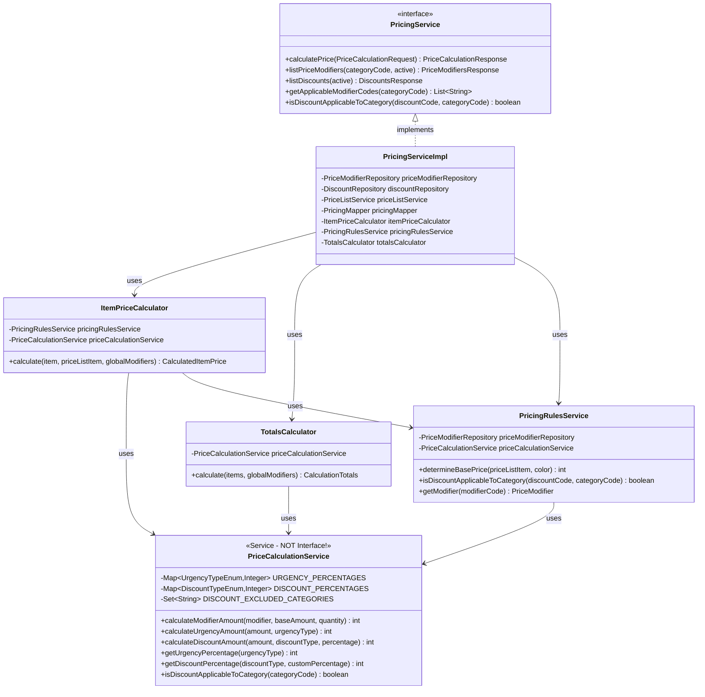

# Class Diagram - Pricing Domain



## Залежності між компонентами

```
┌─────────────────────────────────────┐
│         PricingServiceImpl          │
│  (Точка входу, координатор)         │
└─────────────┬───────────────────────┘
              │ Використовує
              ▼
┌─────────────────────────────────────┐
│    ItemPriceCalculator              │
│    TotalsCalculator                 │ ← Основні калькулятори
│    PricingRulesService              │
└─────────────┬───────────────────────┘
              │ Всі використовують
              ▼
┌─────────────────────────────────────┐
│    PriceCalculationService          │
│    (Центральний математичний сервіс)│ ← НЕ інтерфейс! Це @Service
└─────────────────────────────────────┘
```

## Чому PriceCalculationService НЕ інтерфейс?

1. **Це утилітний сервіс** - містить тільки логіку розрахунків
2. **Не потребує різних імплементацій** - математика однакова
3. **Зберігає константи** - Maps з OpenAPI значеннями
4. **@Service для DI** - Spring інжектить його в інші компоненти

## Типи залежностей

- **→** Прямі залежності (використовує)
- **⇢** Непрямі залежності (через інші компоненти)
- **◆** Композиція (володіє)
- **◇** Агрегація (використовує)