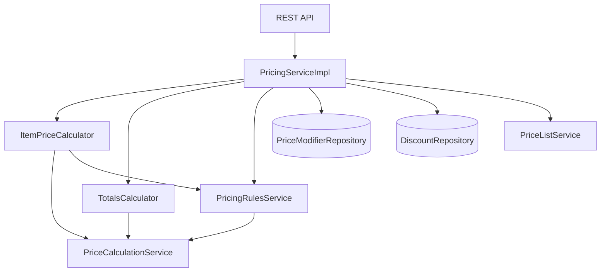

# Pricing Domain Architecture / Архітектура домену Pricing

## Огляд / Overview

Pricing домен відповідає за розрахунок цін на послуги хімчистки згідно з бізнес-правилами, описаними в документі OrderWizard.

## Структура компонентів / Component Structure

```
pricing/
├── PricingService (interface) - Публічний API домену
├── PricingServiceImpl - Координатор, що об'єднує всі компоненти
│
├── calculation/ - Пакет для математичних розрахунків
│   ├── PriceCalculationService - Утиліти для точних розрахунків з BigDecimal
│   ├── ItemPriceCalculator - Розрахунок ціни окремого предмета
│   └── TotalsCalculator - Підрахунок загальних сум замовлення
│
└── rules/ - Пакет для бізнес-правил
    └── PricingRulesService - Логіка вибору цін та перевірка правил
```

## Архітектура взаємодії / Interaction Architecture



## Компоненти детально / Component Details

### 1. PricingServiceImpl
**Роль**: Головний координатор
**Відповідальність**:
- Отримує запити на розрахунок цін
- Координує роботу калькуляторів
- Взаємодіє з репозиторіями для отримання модифікаторів та знижок
- Формує фінальну відповідь

### 2. PriceCalculationService (@Service, не інтерфейс!)
**Роль**: Математичні утиліти
**Відповідальність**:
- Точні розрахунки з BigDecimal
- Зберігає константи з OpenAPI (відсотки терміновості, знижок)
- Конвертація basis points в відсотки
- Перевірка категорій для знижок

**Чому це Service, а не утиліта?**
- Потребує @Service для Spring DI
- Містить бізнес-константи
- Може бути розширений в майбутньому

### 3. ItemPriceCalculator
**Роль**: Калькулятор для окремих предметів
**Відповідальність**:
- Визначає базову ціну (через PricingRulesService)
- Застосовує модифікатори предмета
- Додає терміновість
- Застосовує знижки (якщо дозволено)

**Послідовність розрахунку**:
1. Базова ціна × кількість
2. + Модифікатори (з БД)
3. + Терміновість (% від проміжної суми)
4. - Знижка (якщо категорія дозволена)

### 4. TotalsCalculator
**Роль**: Підсумковий калькулятор
**Відповідальність**:
- Сумує всі розраховані предмети
- Рахує загальну терміновість
- Рахує загальну знижку
- Формує фінальні суми

### 5. PricingRulesService
**Роль**: Бізнес-правила
**Відповідальність**:
- Вибір ціни за кольором (чорний/кольоровий/звичайний)
- Перевірка застосовності знижок
- Отримання модифікаторів з БД

## Джерела даних / Data Sources

### OpenAPI (константи):
- Типи терміновості та їх відсотки (NORMAL 0%, EXPRESS_48H 50%, EXPRESS_24H 100%)
- Типи знижок та їх відсотки (EVERCARD 10%, MILITARY 10%, SOCIAL_MEDIA 5%)
- Категорії виключені зі знижок (LAUNDRY, IRONING, DYEING)

### База даних:
- **PriceModifier**: Складні модифікатори з категоріями застосування
- **Discount**: Розширена інформація про знижки (для майбутнього)
- **PriceListItem**: Базові ціни товарів (через PriceListService)

## Приклад flow розрахунку / Calculation Flow Example

```
1. API Request -> PricingServiceImpl
   {
     items: [{priceListItemId: "uuid", quantity: 2, modifierCodes: ["SILK_FABRIC"]}],
     globalModifiers: {urgencyType: "EXPRESS_48H", discountType: "EVERCARD"}
   }

2. PricingServiceImpl -> ItemPriceCalculator
   - Отримує PriceListItem з PriceListService
   - Передає в ItemPriceCalculator

3. ItemPriceCalculator:
   a) PricingRulesService.determineBasePrice() -> 15000 коп
   b) baseAmount = 15000 × 2 = 30000 коп
   c) Модифікатор SILK_FABRIC (+50%) = +15000 коп
   d) subtotal = 45000 коп
   e) Терміновість EXPRESS_48H (+50%) = +22500 коп
   f) Перевірка знижки: категорія CLOTHING - дозволена
   g) Знижка EVERCARD (-10%) = -6750 коп
   h) finalAmount = 60750 коп

4. TotalsCalculator -> підсумки всіх предметів

5. Response з деталізацією кожного кроку
```

## Чому така архітектура? / Why This Architecture?

1. **Розділення відповідальності**: Кожен клас має чітку роль
2. **Тестованість**: Легко тестувати кожен компонент окремо
3. **Розширюваність**: Легко додати нові правила чи модифікатори
4. **API-first**: Константи в OpenAPI, складна логіка в БД
5. **Точність**: BigDecimal для фінансових розрахунків

## Конфігурація / Configuration

Всі глобальні константи винесені в:
- `pricing-api.yaml` - для генерації DTO з константами
- `PriceCalculationService` - Maps з константами з OpenAPI

Модифікатори та їх правила зберігаються в БД через міграцію 022.