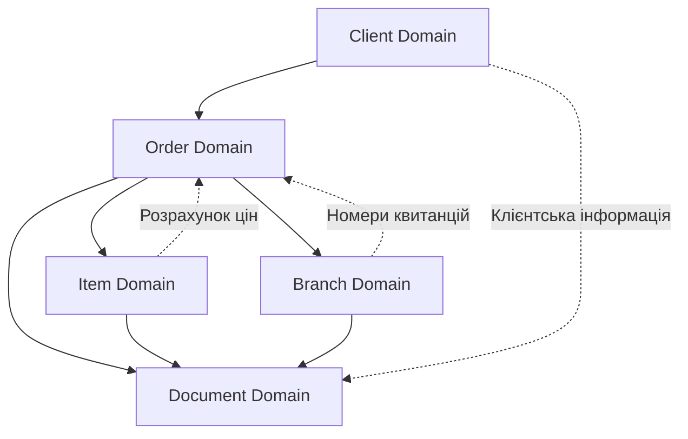

# Order Management System - Архітектурний огляд

## Огляд системи

Односторінкова система управління замовленнями хімчистки, побудована за принципами Domain-Driven Design (DDD) з чітким розділенням на функціональні домени.

## Архітектурні принципи

- **Contract-First**: OpenAPI схеми як основа для генерації DTOs та контролерів
- **Domain-Driven Design**: Чітке розділення на бізнес-домени
- **Single Page Application**: Вся функціональність на одній сторінці
- **Stateless Backend**: API без зберігання стану між запитами
- **SOLID принципи**: Висока когезія, низьке зчеплення

## Core Business Domains

### 1. [Client Domain](domains/01-client-domain.md)

**Відповідальність**: Управління клієнтами хімчистки

- Пошук та створення клієнтів
- Управління контактною інформацією
- Налаштування способів зв'язку
- Відстеження джерел надходження клієнтів

**Ключові entities**: Client, ContactInfo, Address
**API endpoints**: `/api/clients/*`

### 2. [Order Domain](domains/02-order-domain.md)

**Відповідальність**: Основні замовлення та їх параметри

- Створення та управління замовленнями
- Параметри виконання (терміни, терміновість)
- Фінансові розрахунки та знижки
- Способи оплати та передоплата

**Ключові entities**: Order, OrderParameters, Payment
**API endpoints**: `/api/orders/*`

### 3. [Item Domain](domains/03-itemCatalog-domain.md)

**Відповідальність**: Предмети, прайс-лист, характеристики

- Каталог категорій послуг та прайс-лист
- Характеристики предметів (матеріал, колір, дефекти)
- Складна система розрахунку цін з модифікаторами
- Забруднення, дефекти та ризики

**Ключові entities**: ServiceCategory, PriceListItem, ItemCharacteristics, PriceModifier
**API endpoints**: `/api/categories/*`, `/api/items/*`, `/api/modifiers/*`

### 4. [Branch Domain](domains/04-branch-domain.md)

**Відповідальність**: Філії та пункти прийому

- Управління інформацією про філії
- Графіки роботи та контактні дані
- Генерація унікальних номерів квитанцій
- Статистика по філіях

**Ключові entities**: Branch, WorkingSchedule, ReceiptNumber
**API endpoints**: `/api/branches/*`

### 5. [Document Domain](domains/05-document-domain.md)

**Відповідальність**: Документи та квитанції

- Генерація детальних квитанцій з розрахунками
- PDF документи та QR-коди
- Цифрові підписи клієнтів
- Фотодокументація предметів

**Ключові entities**: Document, Receipt, DigitalSignature, Photo
**API endpoints**: `/api/documents/*`, `/api/receipts/*`, `/api/photos/*`

## Міждоменна взаємодія



## Технологічний стек

### Backend

- **Framework**: Spring Boot 3.4.4
- **Language**: Java 21
- **Database**: PostgreSQL 17
- **ORM**: Hibernate/Spring Data JPA
- **API**: REST (Spring Web)
- **Documentation**: OpenAPI 3.0
- **Security**: Spring Security + JWT
- **Validation**: Jakarta Validation
- **PDF Generation**: iTextPDF
- **QR Codes**: ZXing
- **Migrations**: Liquibase

### API Design

- **OpenAPI First**: Схеми як джерело істини
- **DTO Generation**: Автоматична генерація з OpenAPI
- **Controller Generation**: Інтерфейси контролерів з OpenAPI
- **Validation**: Bean Validation через анотації

## Структура проекту

```
backend/
├── src/main/java/com/aksi/
│   ├── domain/
│   │   ├── client/          # Client Domain
│   │   ├── order/           # Order Domain
│   │   ├── itemCatalog/            # Item Domain
│   │   ├── branch/          # Branch Domain
│   │   └── document/        # Document Domain
│   ├── api/                 # Generated Controllers
│   ├── config/              # Configuration
│   └── AksiApplication.java
├── src/main/resources/
│   ├── db/changelog/        # Liquibase migrations
│   ├── openapi/            # OpenAPI schemas
│   └── application.yml
└── target/generated-sources/ # Generated DTOs
```

## OpenAPI Schemas

Кожен домен має свою OpenAPI схему:

- [`client-api.yaml`](openapi/client-api.yaml) - Client Domain API
- [`order-api.yaml`](openapi/order-api.yaml) - Order Domain API
- [`itemCatalog-api.yaml`](openapi/itemCatalog-api.yaml) - Item Domain API
- [`branch-api.yaml`](openapi/branch-api.yaml) - Branch Domain API
- [`document-api.yaml`](openapi/document-api.yaml) - Document Domain API

## Генерація коду

### DTOs та контролери

```bash
# Генерація всіх API
./scripts/generate-api.sh

# Генерація конкретного домену
mvn clean compile -Dapi.domain=client
```

### Валідація схем

```bash
# Валідація OpenAPI схем
swagger-codegen validate -i openapi/client-api.yaml
```

## База даних

### Міграції Liquibase

```
db/changelog/
├── db.changelog-master.yaml
└── domains/
    ├── client/
    ├── order/
    ├── itemCatalog/
    ├── branch/
    └── document/
```

### Іменування таблиць

- `clients` - клієнти
- `orders` - замовлення
- `order_items` - предмети замовлення
- `service_categories` - категорії послуг
- `price_list_items` - прайс-лист
- `price_modifiers` - модифікатори цін
- `branches` - філії
- `documents` - документи
- `receipts` - квитанції
- `photos` - фотографії

## Валідація та помилки

### Стандартні HTTP коди

- `200` - Успішно
- `201` - Створено
- `400` - Помилка валідації
- `404` - Не знайдено
- `409` - Конфлікт (дублювання)
- `500` - Внутрішня помилка

### Формат помилок

```json
{
  "timestamp": "2024-01-15T10:30:00Z",
  "status": 400,
  "error": "Validation Failed",
  "message": "Поле 'phone' є обов'язковим",
  "path": "/api/clients",
  "validationErrors": [
    {
      "field": "phone",
      "message": "Поле 'phone' є обов'язковим",
      "rejectedValue": null
    }
  ]
}
```

## Тестування

### Стратегія тестування

- **Unit Tests**: Доменна логіка, сервіси, репозиторії
- **Integration Tests**: API endpoints, база даних
- **Contract Tests**: OpenAPI схеми проти реальних API

### Тестові дані

```sql
-- Тестові клієнти
INSERT INTO clients (first_name, last_name, phone) VALUES
('Іван', 'Петренко', '+380501234567');

-- Тестові категорії
INSERT INTO service_categories (code, name, standard_days) VALUES
('TEXTILE', 'Чистка одягу та текстилю', 3);
```

## Розгортання

### Docker

```yaml
version: "3.8"
services:
  app:
    image: aksi-backend:latest
    ports:
      - "8080:8080"
    environment:
      - DATABASE_URL=jdbc:postgresql://db:5432/aksi
  db:
    image: postgres:17
    environment:
      - POSTGRES_DB=aksi
```

### Профілі середовищ

- `dev` - Розробка
- `test` - Тестування
- `prod` - Продакшн

## Моніторинг

### Spring Boot Actuator

- `/actuator/health` - Здоров'я додатка
- `/actuator/metrics` - Метрики
- `/actuator/info` - Інформація про версію

### Логування

```yaml
logging:
  level:
    com.aksi: DEBUG
    org.springframework.web: INFO
  pattern:
    console: "%d{yyyy-MM-dd HH:mm:ss} - %msg%n"
```

## Безпека

### Аутентифікація

- JWT токени для API доступу
- Session-based для web інтерфейсу

### Авторизація

- Role-based access control
- Domain-specific permissions

## Наступні кроки

1. **Створення OpenAPI схем** для кожного домену
2. **Генерація DTOs** та контролерів
3. **Liquibase міграції** для таблиць БД
4. **Імплементація доменних сервісів** поетапно
5. **Інтеграційне тестування** API endpoints
6. **Frontend інтеграція** з згенерованими API

## Корисні посилання

- [OpenAPI Specification](https://swagger.io/specification/)
- [Spring Boot Documentation](https://spring.io/projects/spring-boot)
- [Liquibase Documentation](https://docs.liquibase.com/)
- [Domain-Driven Design](https://martinfowler.com/bliki/DomainDrivenDesign.html)
